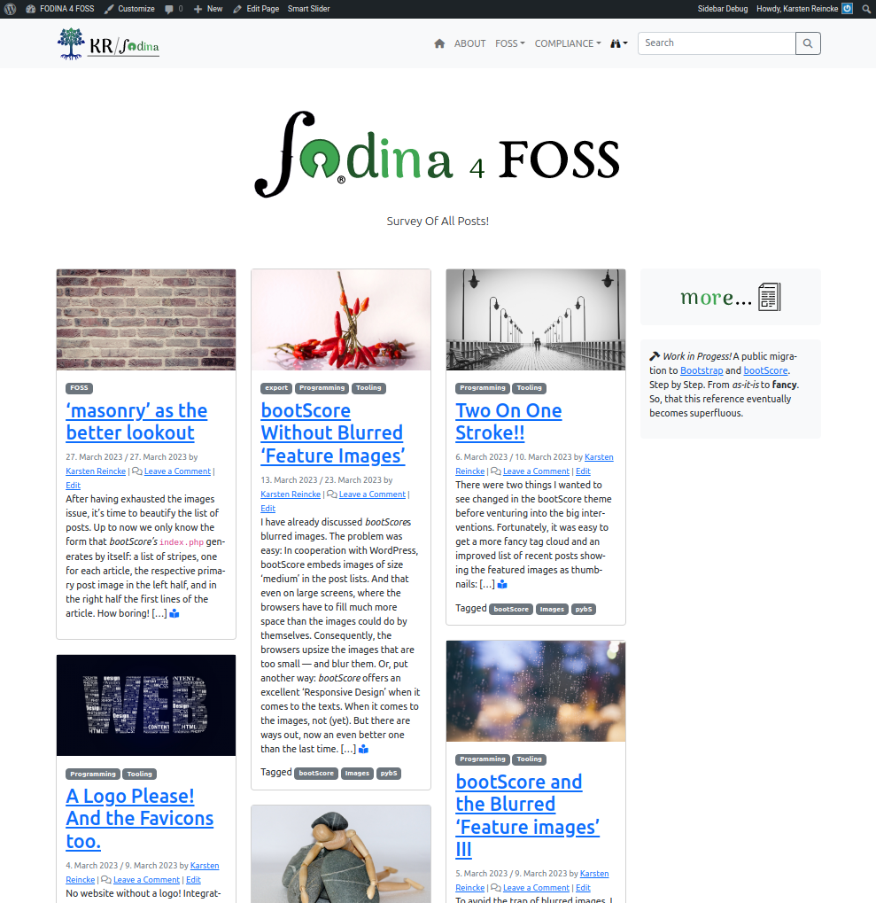

# masonry post list template with a right sidebar using `the_content`

## Purpose

The [original masonry archive of *bootScore*](https://github.com/bootscore/bs-loop-templates) presents the posts in four columns - without any sidebar. Additionally it uses the WordPress function `the_excerpt` and - hence - insert a more-link on the template level.

`masonry-pltpl-sidebar-right-tc.php` reduces the presentation area to three columns, inserts a sidebar on the right side, and replaces `the_excerpt` by `the_concept`. Now, all posts are presented including its html-styling. And those posts, that contain a `<!--more-->` tag (set by their authors) are split into a teaser and the completion.

## Effect

## Installation

* Download the masonry plugin from *bootScore*: [https://bootscore.me/#download](https://bootscore.me/#download)
* Install the plugin into your WordPress theme.
* Download the template `masonry-pltpl-sidebar-right-tc.php` from *bsToppings*: [https://github.com/kreincke/bsToppings/tree/main/masonry-tpl-sbr-tc](https://github.com/kreincke/bsToppings/tree/main/masonry-tpl-sbr-tc)
* Copy `masonry-pltpl-sidebar-right-tc.php` into your theme under the name `home.php` (or any other name in accordance with the [WordPress Template Hierarchy](https://developer.wordpress.org/themes/basics/template-hierarchy/))
* Insert the `<!--more-->`-Tag into all Posts [otherwise the complate post will be displayed in the tile.]
