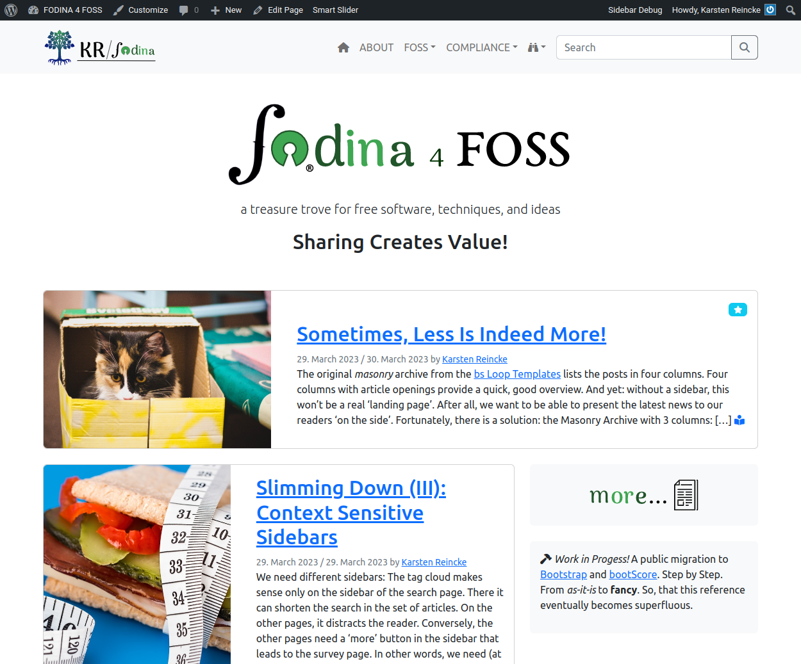

<!-- LTeX:Language=en-US -->
# My Landing Page with 1 sticky post and 1 latest post

## Purpose

A landing page should show the reader what is most important to him. And it should do so at first glance.  Mostly, the most recent post is the most important part of a blog. But sometimes the most recent sticky post is also important. The template *mylap-sp1rp1.php* offers such a door into the site.

## Effect

## Installation

* Download the template `mylap-sp1rp1.php` from *bsToppings*: [https://github.com/kreincke/bsToppings/tree/main/mylap-sp1rp1](https://github.com/kreincke/bsToppings/tree/main/mylap-sp1rp1)
* Move `mylap-sp1rp1.php` to `YourChildTheme/mylap.php`.
* Cre­ate a page mylap via the Word­Press back­end (= my land­ing page)
* Cre­ate a page myplp via the Word­Press back­end (= my post list page)
* In the WordPress backend, acti­vate the but­ton a static page on `Settings/Reading/Your homepage displays`, assign the page *mylap* to the entry *Home­page*, and the page *myplp* to the entry *Posts page*
* Edit the page *mylap* in the Word­Press back­end and replace *Default Tem­plate* in Page options with the tem­plate *mylap*.
* Make the cre­at­ed page *myplp* accessible via your Appearance/Menu 

For details see also [https://fodina.de/streamlining-a/](https://fodina.de/streamlining-a/).